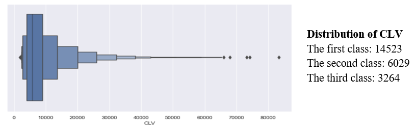

# Customer Lifetime Value analysis and prediction

IBM, a leading high-tech company, specializes in providing cognitive solutions and insurance claim processes primarily to B2B customers. The company introduced **IBM Watson**, an advanced AI assistant catering to car insurance claimants.

Facing a decline in overall market performance, including revenue and net income, IBM identified the customer lifetime value (CLV) as a pivotal metric for strategic enhancement. CLV measures the total expected income from a typical customer throughout their relationship with the business. IBM's current customer management strategy involves analyzing target customers, allocating resources accordingly, and nurturing selected customers to boost future profitability.

